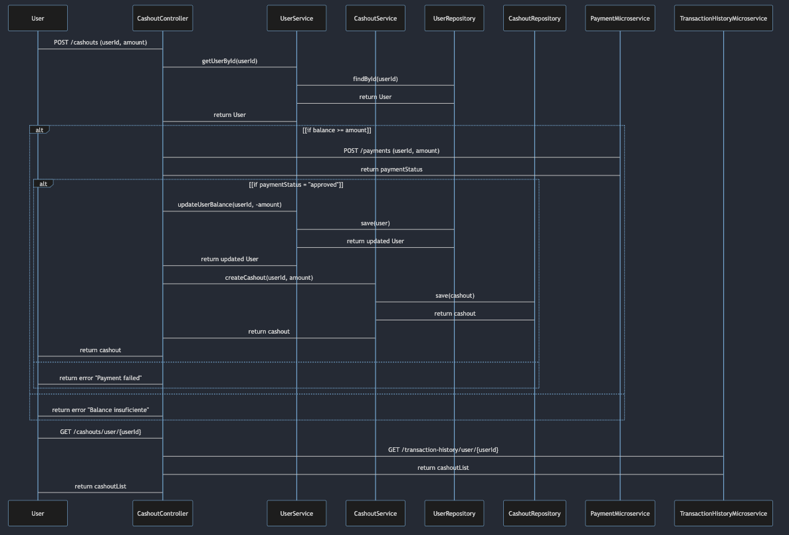

# retoFinal

Descripción del Taller con Microservicios
Este taller está diseñado para que los estudiantes construyan una aplicación utilizando Spring Boot WebFlux y microservicios. El objetivo es implementar un sistema que permita a los usuarios realizar un "cashout" de productos. Parte del reto es implementar llamadas a otros microservicios desde dos de los endpoints principales. Para completar este taller, los estudiantes deben implementar los endpoints descritos a continuación y desarrollar un diagrama de secuencia que ilustre el flujo de las operaciones.

Endpoints a Implementar
User Endpoints
Obtener Usuario por ID

Método: GET
URL: /users/{id}
Entrada: ID del usuario (Long)
Salida: Información del usuario (JSON)
```
{
"id": 1,
"name": "John Doe",
"balance": 100.0
}
```
Crear Usuario

Método: POST
URL: /users
Entrada: Información del usuario (JSON)
```{
"name": "John Doe",
"balance": 100.0
}
```
Salida: Información del usuario creado (JSON)
```{
"id": 1,
"name": "John Doe",
"balance": 100.0
}
```
Actualizar Balance del Usuario

Método: PUT
URL: /users/{id}/balance
Entrada: Monto a actualizar (JSON)
```{
"amount": 50.0
}
```
Salida: Información del usuario actualizado (JSON)
```{
"id": 1,
"name": "John Doe",
"balance": 150.0
}
```
Cashout Endpoints
Crear Cashout

Método: POST
URL: /cashouts
Entrada: Solicitud de cashout (JSON)
```{
"userId": 1,
"amount": 50.0
}
```
Salida: Información del cashout creado (JSON)
```{
"id": 1,
"userId": 1,
"amount": 50.0
}
```
Nota: Este endpoint debe llamar a un microservicio externo que maneje los pagos para verificar y procesar el cashout.

Obtener Cashouts por ID de Usuario

Método: GET
URL: /cashouts/user/{userId}
Entrada: ID del usuario (Long)
Salida: Lista de cashouts (JSON)
```
[
{
"id": 1,
"userId": 1,
"amount": 50.0
},
{
"id": 2,
"userId": 1,
"amount": 30.0
}
]
```

Nota: Este endpoint debe llamar a un microservicio externo que maneje el historial de transacciones para obtener todos los cashouts relacionados con el usuario.

Diagrama de Secuencia

Descripción del Diagrama
El diagrama de secuencia a continuación muestra el flujo de las operaciones para un cashout. El usuario inicia solicitando un cashout, el sistema verifica el balance del usuario, realiza la actualización del balance, llama a un microservicio externo de pagos y finalmente crea un registro de cashout.




Instrucciones para el Taller

Crear la Aplicación Spring Boot: Inicia un nuevo proyecto Spring Boot con WebFlux.
Implementar Endpoints: Desarrolla los endpoints proporcionados en la sección anterior.
Implementar Servicios y Repositorios: Crea los servicios y repositorios necesarios para manejar la lógica de negocio y las operaciones con la base de datos.
Integrar Microservicios Externos: Implementa las llamadas a los microservicios externos para el manejo de pagos y el historial de transacciones.
Diagrama de Secuencia: Utiliza el diagrama de secuencia proporcionado para entender el flujo de las operaciones y asegúrate de que tu implementación siga este flujo.
Probar la Aplicación: Asegúrate de que todos los endpoints funcionen correctamente mediante pruebas unitarias e integradas.
Entrega del Taller
Código Fuente: Subir el código fuente del proyecto a un repositorio en GitHub.
Documentación: Incluir una breve documentación explicando la implementación.
Diagrama de Secuencia: Adjuntar el diagrama de secuencia en el repositorio.
Este taller debe completarse en el transcurso de una semana. ¡Buena suerte y feliz codificación!